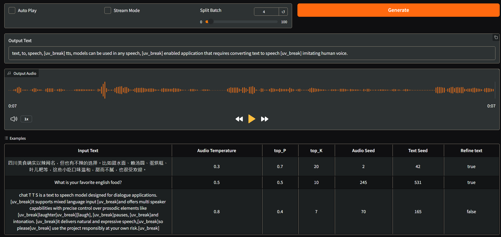

# Local Inference

- [Local Inference](#local-inference)
  - [Tools](#tools)
    - [Backend](#backend)
    - [Frontend](#frontend)
    - [Monitor](#monitor)
    - [Others](#others)
  - [Open Source Model Collections](#open-source-model-collections)
  - [Environment Setup](#environment-setup)
  - [Example Usage](#example-usage)
    - [Ollama](#ollama)
    - [vLLM](#vllm)
    - [Open Web UI](#open-web-ui)
    - [Test OpenAI Compatible API](#test-openai-compatible-api)
  - [Downstream Applications](#downstream-applications)
    - [Immersive Translate 沉浸式翻譯](#immersive-translate-沉浸式翻譯)
    - [TTS (Text-to-Speech)](#tts-text-to-speech)

> [!NOTE]
> The commands in this guide are intended for **Ubuntu Linux**. If you are using a different platform (e.g., Windows or macOS), please refer to the official documentation of the tool for platform-specific instructions.

## Tools

### Backend

> Further Reading: [Ollama vs. vLLM: Choosing the Best Tool for AI Model Workflows](https://collabnix.com/ollama-vs-vllm-choosing-the-best-tool-for-ai-model-workflows/)

- [Ollama](https://ollama.com/) [[Docs](https://github.com/ollama/ollama/tree/main/docs)]

  - [Keep Model Alive in GPU Memory](https://github.com/ollama/ollama/blob/main/docs/faq.md#how-do-i-keep-a-model-loaded-in-memory-or-make-it-unload-immediately)
  - [Handle Concurrent Requests](https://github.com/ollama/ollama/blob/main/docs/faq.md#how-does-ollama-handle-concurrent-requests)

- [vLLM](https://github.com/vllm-project/vllm) [[Docs](https://docs.vllm.ai/en/latest/index.html)]
  - Monitor [Prometheus and Grafana](https://docs.vllm.ai/en/stable/getting_started/examples/prometheus_grafana.html)

### Frontend

- [Open Web UI](https://github.com/open-webui/open-webui)
  - [Environment Variable Configuration](https://docs.openwebui.com/getting-started/env-configuration/)

### Monitor

> [!TIP]
> Check out [prometheus_grafana](./prometheus_grafana) for more details.

- [Grafana](https://github.com/grafana/grafana) [[Docs](https://grafana.com/docs/grafana/latest/)]
- [Prometheus](https://github.com/prometheus/prometheus) [[Docs](https://prometheus.io/docs/introduction/overview/)]

### Others

- [OpenAI & other LLM API Pricing Calculator](https://yourgpt.ai/tools/openai-and-other-llm-api-pricing-calculator) - Calculate the cost of using OpenAI and other Large Language Models (LLMs) APIs

## Open Source Model Collections

- [DeepSeek | Hugging Face](https://huggingface.co/deepseek-ai)
- [Taiwan LLM | Hugging Face](https://huggingface.co/taiwan-llm)

## Environment Setup

First, clone the repository:

```bash
git clone --recurse-submodules https://github.com/xxrjun/local-inference.git
```

Then, create a new [Conda](https://docs.conda.io/projects/conda/en/latest/user-guide/install/index.html) environment and install the required dependencies:

```bash
conda env create -n local-inference python=3.12
conda activate local-inference

# Install Python dependencies
pip install -r requirements.txt

# Install Ollama on Linux
curl -fsSL https://ollama.com/install.sh | sh
```

## Example Usage

It is recommended to use [tmux](https://github.com/tmux/tmux) to manage multiple sessions.

### Ollama

```bash
tmux new -s ollama-serve
./scripts/ollama_serve.sh
```

```bash
tmux new -s ollama-run
./scripts/ollama_run.sh
```

### vLLM

```bash
tmux new -s vllm-serve
./scripts/vllm_serve.sh
```

### Open Web UI

```bash
tmux new -s open-webui
./scripts/open_webui.sh
```

### Test OpenAI Compatible API

Copy `.env.example` to `.env`:

```bash
cp .env.example .env
```

Edit `.env` with the correct values, then run the test script:

```bash
python scripts/test_openai_client.py
```

If the API is working correctly, the output should resemble the following:

```bash
ChatCompletionMessage(content='Hello! How can I help you today? If you have any questions or need assistance, feel free to ask.', refusal=None, role='assistant', audio=None, function_call=None, tool_calls=[], reasoning_content=None)
```

## Downstream Applications

### [Immersive Translate 沉浸式翻譯](https://immersivetranslate.com/)

Refer to [My Immersive Translate Setup Guide](./applications/immersive_translate/) or [Offical Docs](https://immersivetranslate.com/docs/services/ai/)，


### TTS (Text-to-Speech)

What is TTS?

- [Text-to-Speech | Huggingface](https://huggingface.co/tasks/text-to-speech)
- [Text-to-speech | NVIDIA](https://www.nvidia.com/en-us/glossary/text-to-speech/)

Refer to the [My TTS Setup Guide](./applications/tts/README.md) for more details.


