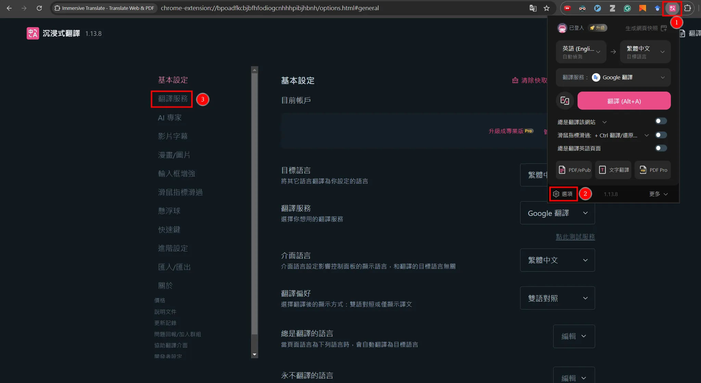
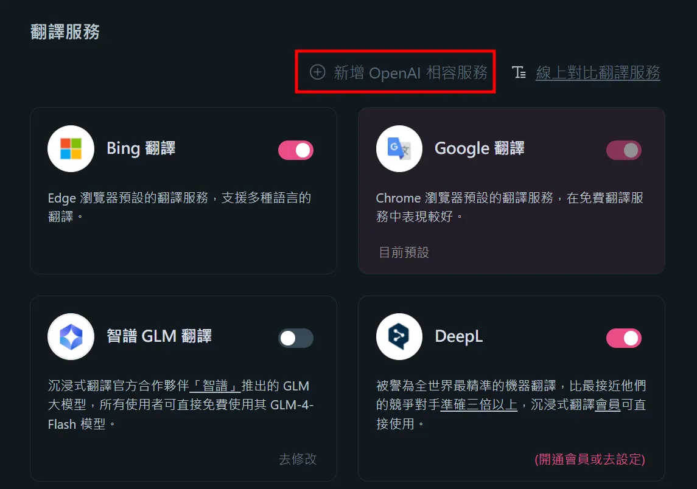
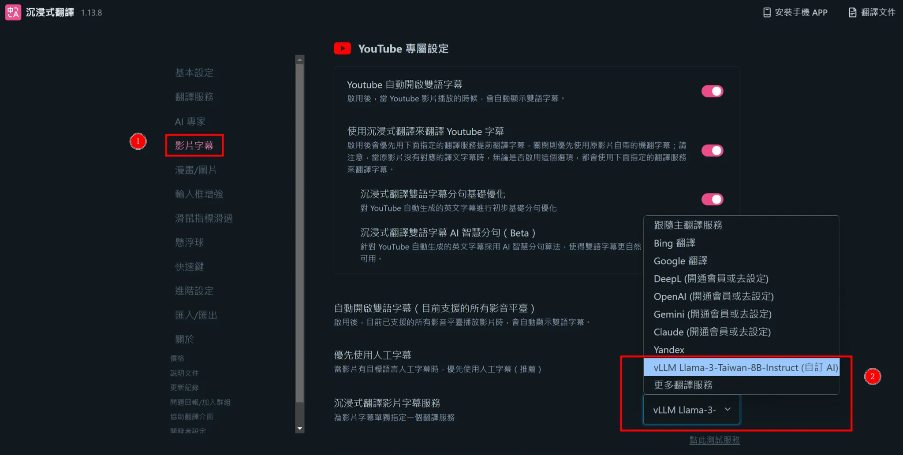

# Immersive Translation Setup Guide

1. Install the extension [Immersive Translate - Translate Web & PDF](https://chromewebstore.google.com/detail/immersive-translate-trans/bpoadfkcbjbfhfodiogcnhhhpibjhbnh) on a supported browser.
2. Configure translation services by either running a service locally or purchasing access, following the instructions in [Temporary AI Model Integration](https://immersivetranslate.com/zh-TW/docs/services/ai/).
   - You can use [vLLM](https://github.com/vllm-project/vllm) or [Ollama](https://ollama.com/) with open-source models for local deployment.
3. Open the extension settings page, add a translation service, and configure it accordingly.

   

   

4. Select the appropriate translation service for video subtitles.

   

## ZH-TW Guide

1. 於支援的瀏覽器安裝套件 [Immersive Translate - Translate Web & PDF](https://chromewebstore.google.com/detail/immersive-translate-trans/bpoadfkcbjbfhfodiogcnhhhpibjhbnh)。
2. 根據[其他 AI 模型臨時接入](https://immersivetranslate.com/zh-TW/docs/services/ai/)運行服務或購買服務。
   - 可以使用 [vLLM](https://github.com/vllm-project/vllm) 或 [Ollama](https://ollama.com/) 搭配開源模型於本機端運行。
3. 進入套件設定頁面，新增翻譯服務並設定。

   

   

4. 將影片字幕選擇對應的服務。

   
