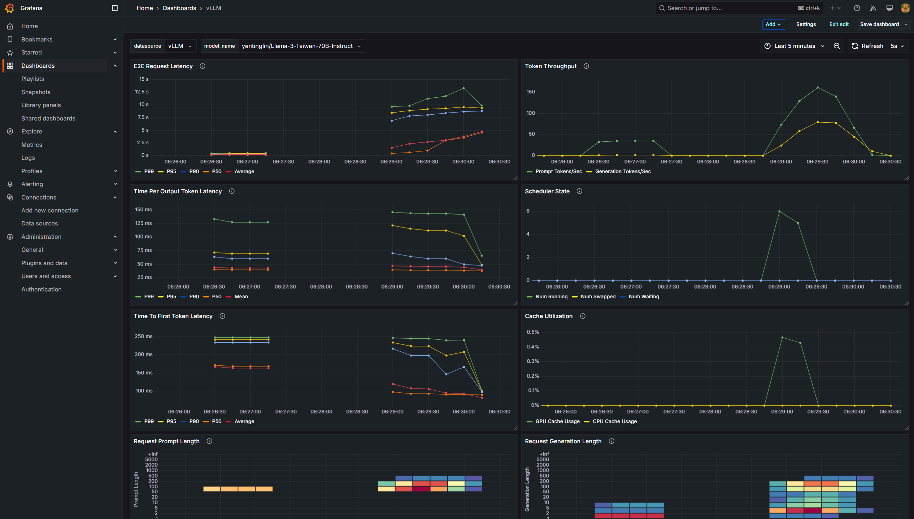
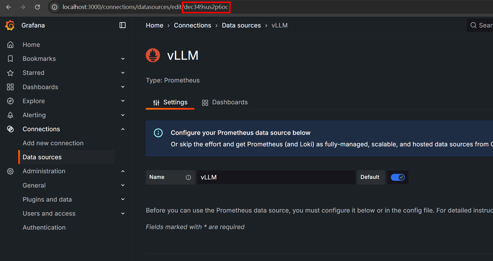

# Prometheus and Grafana



## Installing Grafana

Please refer to [Grafana Download Section](https://grafana.com/grafana/download?pg=get&plcmt=selfmanaged-box1-cta1&edition=oss) for the latest version.

First, install the required dependencies:

```bash
sudo apt-get install -y adduser libfontconfig1 musl
wget https://dl.grafana.com/oss/release/grafana_11.5.1_amd64.deb
sudo dpkg -i grafana_11.5.1_amd64.deb
```

Then, start the Grafana service if you are using systemd:

```bash
### NOT starting on installation, please execute the following statements to configure grafana to start automatically using systemd
 sudo /bin/systemctl daemon-reload
 sudo /bin/systemctl enable grafana-server
### You can start grafana-server by executing
 sudo /bin/systemctl start grafana-server
```

Otherwise, you can start it manually:

```bash
sudo service grafana-server start
```

You can change the default port from 3000 to a custom one by [editing the `grafana.ini` configuration file](https://grafana.com/docs/grafana/latest/setup-grafana/configure-grafana/#remove-comments-in-the-ini-files).

## Installing Prometheus

This is an example script to download Prometheus on Linux. Please refer to [Prometheus Donwload Section](https://prometheus.io/download/) and [Getting Started](https://prometheus.io/docs/prometheus/latest/getting_started/) for the latest version.

```bash
wget https://github.com/prometheus/prometheus/releases/download/v3.2.0-rc.1/prometheus-3.2.0-rc.1.linux-amd64.tar.gz
tar xvfz prometheus-3.2.0-rc.1.linux-amd64.tar.gz
cd prometheus-3.2.0-rc.1.linux-amd64
```

Launch Prometheus with the following command:

```bash
# default port is 9090
./prometheus --config.file=../prometheus.yaml --web.listen-address=:<port>
```

Futher Reading: [How to Change Prometheus Port - A Step-by-Step Guide](https://signoz.io/guides/configure-prometheus-to-use-non-default-port/)

You can access Prometheus Web UI at `<prometheus_ip:port>/targets`.

## Adding Data Source

Before upload `grafana.json` provided in [vLLM Docs](https://docs.vllm.ai/en/stable/getting_started/examples/prometheus_grafana.html#grafana-dashboard), you need to modify the **data source uid** in the json file. Just replace all `edx8memhpd9tsa` in the json file with your own data source uid.

You can find the data source id in the URL when you are editing the data source in Grafana. (Connections -> Data Sources)



## References

- [vLLM Docs - Prometheus and Grafana](https://docs.vllm.ai/en/stable/getting_started/examples/prometheus_grafana.html#grafana-dashboard)
- [Day29 - vLLM 實作篇 PART5：監控 vLLM](https://ithelp.ithome.com.tw/articles/10360998)
